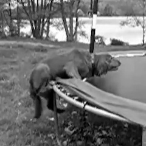
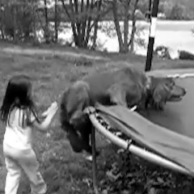
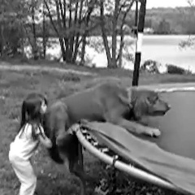
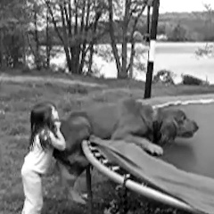
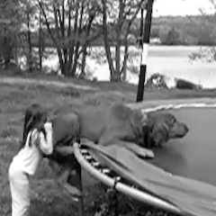

# CS6476 team 42 Project: Using CNN-LSTM and Vision Transformers to perform video transition classification

## Description

The aim of this project is to investigate the performance different types of Deep Learning (DL) architectures on a video classification task. The classification task is inspired by [[1]], where the authors mentioned classifying transition of intentionality ("Oops!") from videos. The dataset is an excerpt of the original dataset posted by [[1]], and we perform all training tasks on this smaller dataset. The dataset is accessible [here] (Georgia Tech Sharepoint).

### Sample data

    <b>Example of a video without "Oops":</b> 
    <a href="https://youtu.be/zkm6EhrSDso">No Oops! video</a>

#### Selected frames from the video:

| Image 1 | Image 2 | Image 3 | Image 4 | Image 5 |
|---------|---------|---------|---------|---------|
|  |  |  |  |  |

    <b>Example of a video with "Oops":</b> 
    <a href="https://youtu.be/CBYLn15tSCA">Oops! video</a>

## Reference
[1]: https://arxiv.org/pdf/1911.11206.pdf
[\[1\] D. Epstein, B. Chen, and C. Vondrick, “Oops! Predicting Unintentional Action in Video,” Jun. 2020.](https://arxiv.org/pdf/1911.11206.pdf)

[here]: https://gtvault.sharepoint.com/:f:/s/CVTeam/EkSa6fRmLYFEtbkHedlofBgB1Pm76-SfRxSppaaKjWZCmw?e=sItsAG